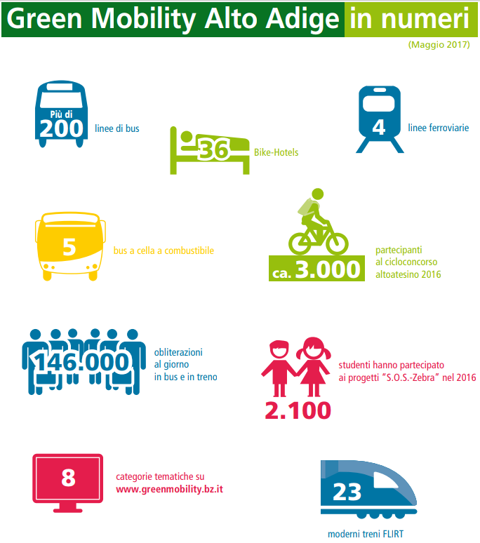
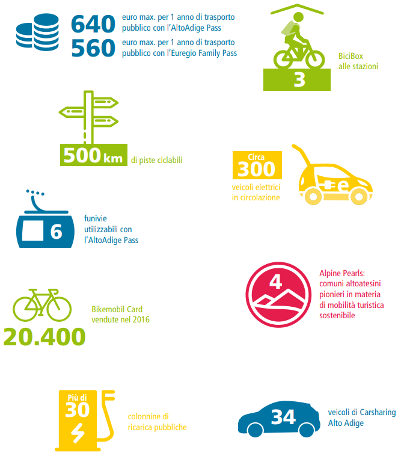

14/10/2018 - Matteo Golinelli
___

# Benchmarking

## 1) Already existing examples

### Alto Adige - Green Mobility

[Green mobility](https://www.greenmobility.bz.it/it/ "Green mobility")

[Mobilità sostenibile](http://www.provincia.bz.it/turismo-mobilita/mobilita/mobilita-sicura-sostenibile/mobilita-sostenibile.asp "Mobilità sostenibile")

##### Descrizione
Il progetto “Green Mobility” nasce dall’idea di sviluppare l’Alto Adige come regione modello per la mobilità alpina sostenibile e si occupa di tutte le forme di trasporto sostenibili e del loro coordinamento; in più spiana la strada per innovazioni e nuovi progetti. Green mobility prevede l'utilizzo di diversi mezzi, ma non solo:
- **Scooter** elettrici
- **Carsharing** con auto elettriche
- **Bus** ecologici a cella combustibile (ad idrogeno)
- **Treni** comodi e frequenti
- **Funivie**
- **Infrastrutture di ricarica** per auto elettriche distribuite capillarmente sul territorio
- **Zone pedonali** curate

##### Obiettivi
Oltre a garantire un buon sistema di trasporto pubblico urbano, la mobilità sostenibile dovrà essere sviluppata in modo che l’Alto Adige mantenga un’alta qualità di vita, aumenti la sua attrattività turistica, stimoli la competitività economica e contribuisca a mobilizzare nuovi settori tecnologici ed economici. Per realizzare questi obiettivi, Green Mobility punta soprattutto sulla mobilità elettrica ed intermodale, e sulla mobilità in bici. Sono, infatti, molte le misure progettate per ampliare e collegare tra di loro le varie forme di mobilità sostenibili (trasporti pubblici urbani, spostamenti in bicicletta o a piedi). Un altro aspetto chiave riguarda i trasporti privati motorizzati: soprattutto con l’aiuto della mobilità elettrica contribuiranno ad abbassare i livelli di emissioni del traffico.

##### Innovating ideas
- **Mobilità elettrica**
    - Agevolazioni per l'acquisto di auto elettriche per privati, enti pubblici ed associazioni
    - Contributi per la mobilità elettrica per le imprese
    - Contributi per stazioni di ricarica
- **Mobilità sostenibile**: contributi per attività finalizzate allo sviluppo della mobilità sostenibile e alla riduzione degli effetti negativi del traffico sull'ambiente, sulla salute e sullo sviluppo sociale ed economico
- **Trasporto combinato**: la merce è trasportata almeno da due tipi di mezzo di trasporto (esempio: treno e autoveicolo pesante).
- **Radshow mobilità elettrica**: una serie di eventi durante la quale è possibile provare in prima persona mezzi elettrici (biciclette, scooter, auto) e nel quale si mettono a contatto possibili acquirenti direttamente con i commercianti.
- **Cicloconcorso "l'Alto Adige pedala"**: un concorso della durata di alcuni mesi (16 marzo - 30 settembre per il 2018) al quale può partecipare chiunque, con la possibilità di vincere premi se si superano i 100km. Per inserire i propri percorsi è possibile utilizzare un'applicazione o il [sito web](https://www.altoadigepedala.bz.it/ "l'Alto Adige pedala").
- **Carsharing**: con auto elettriche in diversi punti noleggio. Le macchine sono prenotabili telefonicamente o tramite app, per uno o più giorni, o anche solo per alcune ore.

##### Risultati

## 2) Classify examples
