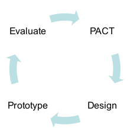
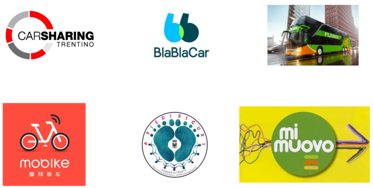

# Progetto: Mobilità sostenibile

## Output del progetto
Un prototipo mediamente fedele volto ad incoraggiare le persone ad aumentare l'utilizzo di mezzi per la mobilità sostenibili.

###### Possibili strategie
- Consapevolezza
- Gamificazione
- Approccio con tecnologie persuasive
- Giochi

### Fasi di lavoro del progetto
1. Analisi di prodotti esistenti
2. Ideazione (identificazione dello spazio di design)
3. Analisi PACT
4. Design
5. Prototipizzare
6. Valutazione

La parte da 3 a 6 va iterata due volte.

## Mobilità sostenibile
Sistemi di trasporto che permettono di ridurre l'impatto ambientale, sociale ed economico delle macchine private. Possono essere volti a ridurre
- l'inquinamento dell'aria
- il rumore
- il traffico
- gli incidenti
- l'occupazione di spazio
- i costi.

Sostnibile | Mobilità
------------ | -------------
Non  inquinante | Viaggio delle vacanze
Basse emissioni di CO2 | Viaggi giornalieri brevi
Mezzi di trasporto condivisi | Viaggi di pendolari

###### Esempi

## Benchmarking
Metodo creato ed utilizzato principalmente nel settore del business. E' volto ad identificare i migliori prodotti e le migliori pratiche in un'industria. Comparando i prodotti e le pratiche identificati, è possibile capire:
- A che bisogno del mercato si riferiscono
- Come sono differenziati tra loro i prodotti
- Quanto sono performanti

### Obiettivi del benchmarking
- Avere una visione generale dei sistemi esistenti.
- Ispirare il design. Funge da libreria di design a cui ispirarsi.

### Come fare un benchmarking
1. Collezionare esempi esistenti nell'ambito desiderato ed organizzarli (nome, immagine rappresentativa, descrizione, URL, parole chiave).
2. Classificare gli esempi per affinità (tematica, target di utenti, PACT, strategia di design adottata, ...). E' utile utilizzare una mappa concettuale.

## Definizione dello spazio di design

### Criteri decisionali
1. Identificazione di un bisogno delle persone e/o di un buco nel mercato.
2. Interessi personali.
3. Facilità di accesso al campo.
4. Valutazione realistica delle tempistiche.

## Requisiti utente
Sono la traduzione dei bisogni degli utenti in feature del sistema. Specificano cosa e come il prodotto dovrà fare. Devono essere più specifici e chiari il possibile ed è importante che non siano ambigui.
I requisiti devono essere relazionati e giustificati da dei dati.

Non devono essere un insieme di rigide prescrizioni, ma non devono neanche cambiare radicalmente durante il design e la fase di valutazione. Possono essere rivisti in seguito alla fase di valutazione.

I requisiti sono importanti anche per avere un documento che permetta di capire a tutte le persone coinvolte nel progetto a cosa si sta lavorando.

### Come definire i requisiti utente
Identificare i bisogni degli utenti, cercando di comprendere le loro attività, il contesto di utilizzo, ...

E' importante definire un insieme di requisiti stabili (immutabili).

1. Raccogliere dati
   - Studiare la documentazione
   - Ricercare prodotti simili
   - Osservazioni: passare del tempo con gli utenti
   - Fare questionari
   - Fare interviste, anche di gruppo
2. Analizzare i dati
3. Ottenere un risultato
4. Tradurre il risultato in dei requisiti

### Classificazione dei requisiti
- **Funzionali**: caratteristiche fondamentali ed essenziali del prodotto, descrivono cosa dovrà fare il prodotto.
- **Non funzionali**: descrivono i vincoli del sistema e del suo sviluppo. Coprono un gran numero di aspetti: usabilità, performance, mantenibilità, sicurezza, ...

### Errori
- Sottostimare la complessità
- Mancato coinvolgimento delle parti in gioco